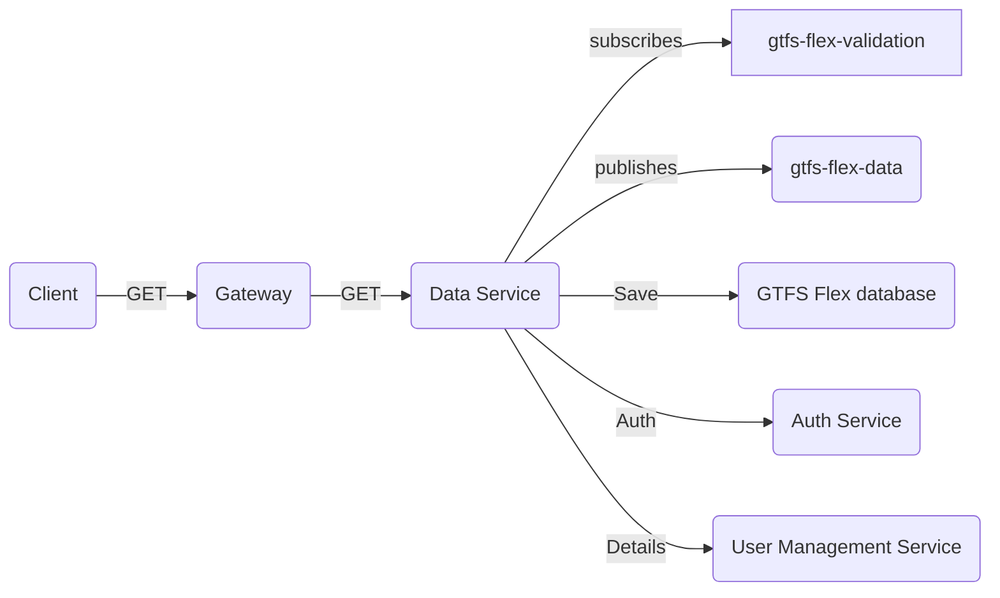
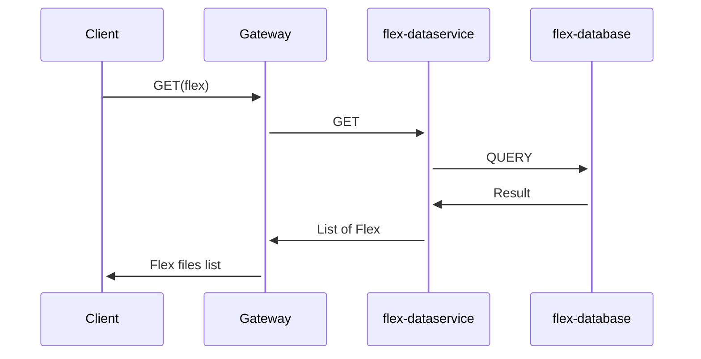

# Introduction 
GTFS Flex data service (micro-service) helps the TDEI system to persisting & querying the information specific to the GTFS flex. 

## Getting Started

The project is built on NodeJS framework. All the regular nuances for a NodeJS project are valid for this.

## System requirements

| Software | Version|
|----|---|
| NodeJS | 16.17.0|
| Typescript | 4.8.2 |

## Environment variables
---

Application configuration is read from .env file. Below are the list of environemnt variables service is dependent on. An example of environment file is available [here](./env.example) and description of environment variable is presented in below table

|Name| Description |
|--|--|
| PROVIDER | Provider for cloud service or local (optional) |
|QUEUECONNECTION | Queue connection string |
|STORAGECONNECTION | Storage connection string|
|PORT |Port on which application will run|
|VALIDATION_SUBSCRIPTION | Upload topic subscription name|
|VALIDATION_TOPIC | Validation topic name|
|AUTH_HOST | Base URL for Authentication server |
|POSTGRES_USER | Database user name|
|POSTGRES_HOST | Database host url|
|POSTGRES_PASSWORD | Database user password|
|POSTGRES_DB | Database name|
|POSTGRES_PORT | Database port|
|SSL | false when running locally otherwise true|
|SERVICE_URL | User management /service url|
|DATASVC_TOPIC | Data service topic|


## Local Postgresql database setup
---

Step 1: Ensure all the environment variables are setup.

Step 2: Ensure docker is installed on local system. 

Step 3: Run below command which will setup Postgresql database and PgAdmin client console for postgresql database.

```docker compose up```  from root directory

## Build
---

Follow the steps to install the node packages required for both building and running the application

1. Install the dependencies. Run the following command in terminal on the same directory level as `package.json`
    ```shell
    npm install
    ```
2. To start the server, use the command `npm run start`
3. The http server by default starts with 3000 port or whatever is declared in `process.env.PORT` (look at `index.ts` for more details)
4. Health check available at path `health/ping` with get and post. Make `get` or `post` request to `http://localhost:3000/health/ping`.
Ping should respond with "healthy!" message with HTTP 200 status code.

## Test

Follow the steps to install the node packages required for testing the application

1. Ensure we have installed the dependencies. Run the following command in terminal on the same directory level as `package.json`
    ```shell
    npm install
    ```
2. To start testing suits, use the command `npm test` , this command will execute all the unit test suites defined for application.

## Database schema
---

Database schema can be found [here](https://github.com/TaskarCenterAtUW/TDEI-internaldocs/blob/master/adr/database-schema.md) for reference.

## System flow
---

Diagram describes the Data service system flow



- `Client`, makes HTTP GET calls to `Gateway`
    - Retrive the list of GTFS Flex files with/without search criteria.
    - Download the GTFS Flex file given the tdei_record_id

- `Data Service`, subscribes to `gtfs-flex-validation` topic to listen to validation results of the gtfs-flex file upload request.

- `Data Service`, authorizes the every incoming request against the `Auth Service` 

- `Data Service`, gets the TDEI entity details from `User Management Service` 

- If validation is failed , Data Service publishes the information to `gtfs-flex-data` topic to update request status complete without persisting the information.

- If validation is successful , Data Service first persists the information to the `GTFS Flex database` and publishes the information to `gtfs-flex-data` topic to update request status complete.

- `gtfs-flex-validation` topic message schema can be found [here](https://github.com/TaskarCenterAtUW/TDEI-event-messages/blob/dev/schema/gtfs-flex-validation-schema.json)

- `gtfs-flex-data` topic message schema can be found [here](https://github.com/TaskarCenterAtUW/TDEI-event-messages/blob/dev/schema/gtfs-flex-validation-schema.json)


- Sample GET calls interaction with DB


